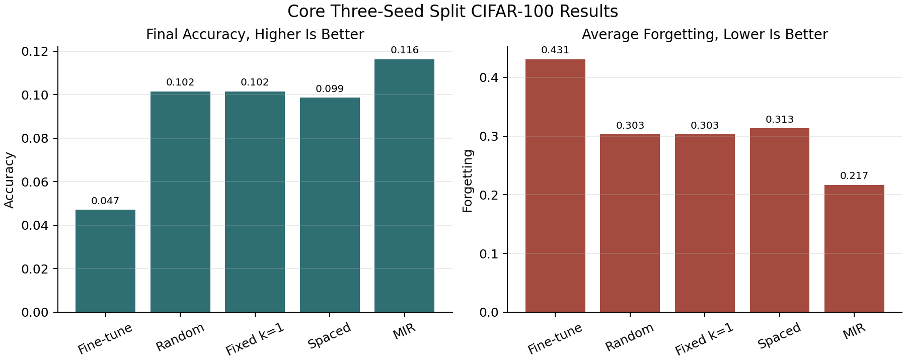
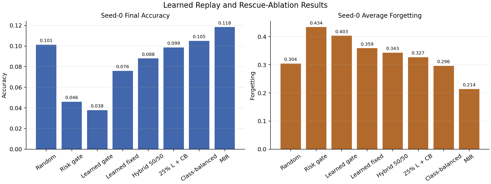
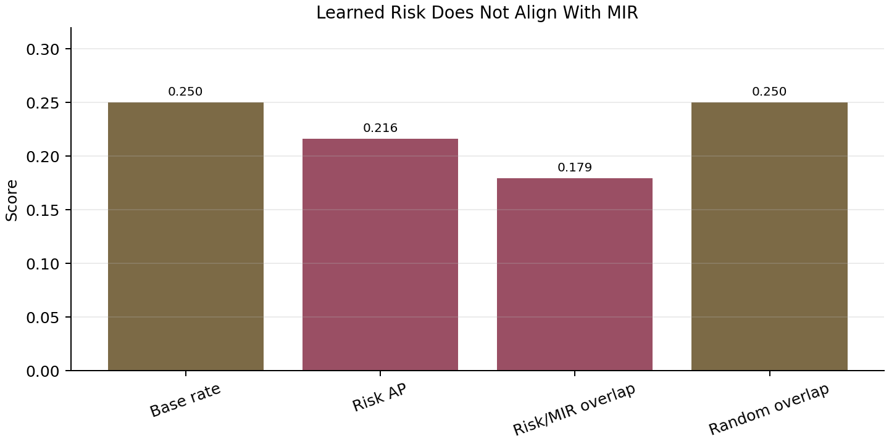

# Task 25 Final Synthesis

## One-Sentence Result

The project successfully built a controlled Split CIFAR-100 continual-learning
study and showed that forgetting can be predicted offline, but the replay
methods that used the current learned forgetting-risk score did not beat random
replay online; MIR remains the strongest implemented replay method because it
selects examples based on current-update interference instead of general future
forgetting risk.

## Background

Continual learning studies what happens when a model learns a sequence of tasks
instead of seeing all training data at once. The problem is that neural networks
often suffer from catastrophic forgetting: after learning a new task, they lose
performance on older tasks.

This project studies replay as the main defense. Replay means keeping a small
memory of old examples and mixing some of those old examples into training when
the model learns a new task. The simple intuition is like studying: if the model
reviews old material while learning new material, it may forget less.

The original proposal added a more specific idea: instead of replaying old
examples randomly, predict which examples are close to being forgotten and replay
those examples at useful times. The proposal calls for sample-level forgetting
signals, such as loss, uncertainty, gradient norms, and representation drift, and
for a scheduler that estimates something like a sample-specific forgetting time
`T_i`.

That creates three separate research questions:

| Claim | Plain meaning | What the project tested |
| --- | --- | --- |
| Prediction | Can we tell which examples are likely to be forgotten later? | Offline forgetting predictors and signal ablations. |
| Timing | Can we estimate when an example is likely to be forgotten? | Time-to-forgetting targets and the first spaced scheduler proxy. |
| Intervention | Does using that prediction for replay improve training? | Spaced, risk-gated, learned-risk, hybrid, class-balanced, and MIR replay comparisons. |

The most important lesson is that prediction and intervention are not the same
thing. A model can predict "this example may be forgotten later" and still fail
to choose the best example to replay right now.

## Primary Benchmark

The locked benchmark is Split CIFAR-100. CIFAR-100 has 100 image classes. The
project splits those classes into 10 sequential tasks with 10 classes per task.
The model learns task 0, then task 1, and so on until task 9.

The main setup is intentionally small and controlled:

| Setting | Value |
| --- | --- |
| Dataset | Split CIFAR-100 |
| Tasks | 10 tasks |
| Classes per task | 10 |
| Model | Flatten MLP |
| Hidden dimension | 256 |
| Optimizer | SGD |
| Learning rate | `0.01` |
| Epochs per task | 1 |
| Batch size | 32 |
| Replay buffer capacity | 2000 examples |
| Replay batch size | 32 examples |
| Main repeated seeds | 0, 1, 2 |

This benchmark is not meant to be a state-of-the-art image classifier. It is a
controlled environment for measuring forgetting and replay behavior. That is why
the important question is not "is the final accuracy high in absolute terms?"
but "does one replay strategy protect old tasks better than another under the
same budget?"

## Evaluated Values

The project uses an accuracy matrix. After each task finishes training, the
model is evaluated on every task it has already seen. Future tasks are not
included.

| Metric | Simple meaning | Why it matters |
| --- | --- | --- |
| Final accuracy | Average accuracy across all tasks after the final task. Higher is better. | This is the final "how much does the model still know?" score. |
| Average forgetting | How much performance dropped from a task's best earlier score to its final score. Lower is better. | This directly measures catastrophic forgetting. |
| Replay samples | Number of old examples replayed during training. | This measures compute/use of replay budget. |
| Average precision, AP | Whether a predictor ranks true future-forgotten examples near the top. Higher is better. | Useful when forgotten and not-forgotten labels are imbalanced. |
| ROC-AUC | Whether a random forgotten example is ranked above a random non-forgotten example. Higher is better. | A threshold-independent ranking measure. |
| Top-k precision | Among the top-ranked examples, how many are true positives. Higher is better. | Important because replay often only uses a small selected set. |
| MIR overlap | How often learned-risk selection agrees with MIR's current-interference selection. | Tests whether the learned score is choosing examples for the same reason as MIR. |

## Report Figures

The figures below can be regenerated with:

```powershell
.\.venv\Scripts\python.exe scripts\plot_final_synthesis.py
```








## Methods

### Fine-Tuning

Fine-tuning is the no-replay baseline. The model trains on each task in sequence
and never reviews old examples.

Technically, this is the simplest trainer path: for each task, it runs standard
SGD on only the current task's data, then evaluates all seen tasks. It has no
memory buffer and no replay selector.

It is important because it shows whether the benchmark actually has a forgetting
problem. It does: final accuracy is very low and average forgetting is high.

### Random Replay

Random replay stores old examples in a bounded replay memory. While training on
a new task, it samples old examples uniformly from that memory and trains on
them together with the current batch.

Technically, random replay uses a reservoir-style buffer and a replay batch of
32 old examples. It does not try to be smart about which old examples are
important. Its strength is diversity: because selection is random, it tends to
cover a broad mix of old classes and examples.

Random replay is the main baseline that the proposed scheduler must beat. If a
new method cannot beat random replay with the same replay budget, the new method
is not yet useful as a replay policy.

### Fixed-Periodic Replay

Fixed-periodic replay asks whether timing alone matters. Instead of replaying
according to risk, it replays uniformly every fixed number of optimizer steps.

In the main budget-matched setting, `k=1`, which means it replays at every
eligible step and uses the same replay sample count as random replay. This makes
it a clean timing/control baseline rather than a new smart selector.

In the current results, fixed-periodic replay is effectively the same as random
replay under the matched budget.

### First Spaced Replay Proxy

The first spaced replay scheduler is the earliest implementation of the
proposal idea. It tracks sample-level signals such as loss, uncertainty,
target-class probability, replay count, and loss increases. It maps high risk to
shorter replay intervals and lower risk to longer intervals.

Technically, the scheduler maintains per-sample state in the replay buffer. Each
sample has a risk score and a next-due step. When the trainer needs replay
examples, the scheduler prefers examples that are due and high risk.

This implements a spacing-inspired mechanism, but it is still a proxy. It does
not yet prove a strong learned `T_i` estimate. It tests whether this first
risk-plus-due-time rule improves retention.

### Risk-Gated Replay

Risk-gated replay asks a compute-saving question: should the model skip replay
unless examples look close to forgetting?

Technically, it uses replay only when candidate examples pass risk or due-time
gates. If no old examples look urgent, the trainer skips replay for that batch.
This can greatly reduce replay sample count.

The result is negative. It saved replay work, but old-task retention collapsed
toward fine-tuning. In plain terms, it reviewed less, but it forgot too much.

### Learned Forgetting Predictors

The learned predictor is an offline model that tries to predict whether a sample
will be forgotten later. The project implemented proposal-aligned lightweight
models, especially logistic regression and linear SVM classifiers.

Technically, the predictor is trained from saved experiment logs. Each row
contains features available at an earlier anchor time, and the label is derived
from later evaluations. The train/test split is temporal, so the predictor does
not train on future information from the same time horizon it is evaluated on.

The strongest logistic regression model uses cheap features such as loss,
uncertainty, target probability, replay count, and loss-history summaries. It
performed well as an offline predictor.

### Learned Risk-Gated Replay

Learned risk-gated replay replaces the cheap hand-written risk score with the
learned logistic regression probability.

Technically, it trains the predictor from prior run artifacts and then uses that
predictor during a new replay run. A memory sample receives a predicted
forgetting probability; replay happens only when the predicted risk passes the
gate.

This also failed as an intervention. The offline predictor looked strong, but
the online sparse replay policy did not retain old tasks well.

### Learned Fixed-Budget Replay

Learned fixed-budget replay isolates the selection question. It removes the
"skip replay" decision and uses the same replay sample count as random replay.
The only difference is which examples are chosen: highest predicted forgetting
risk instead of random samples.

Technically, it fills each replay batch by ranking memory examples with the
learned predictor and selecting the highest-risk examples.

This result is important because it shows the failure is not only caused by
sparse replay. Even with the same replay count as random replay, pure learned
risk ranking was worse than random replay.

### Learned Hybrid Replay

Hybrid replay protects diversity. Instead of selecting every replay example by
learned risk, it uses a mixture, such as some learned-risk examples and some
class-balanced or random examples.

Technically, each replay batch is split into two parts. One part is chosen by
predicted risk. The other part is chosen to preserve class coverage or random
diversity.

Hybrid replay improved over pure learned-risk replay, but it still did not beat
random replay. That suggests the learned risk score was over-focusing on
examples that looked risky but were not the best examples for protecting the
model.

### Class-Balanced Replay

Class-balanced replay chooses replay examples to cover old classes more evenly.
It does not use the learned forgetting predictor.

Technically, it groups memory examples by class and samples so that old classes
receive more even representation inside replay batches.

This simple method slightly beat random replay on the seed-0 rescue ablation.
That is a useful warning: before claiming a smart predictor helps, the project
must compare against simple diversity and balance rules.

### MIR Replay

MIR stands for Maximally Interfered Retrieval. It is a stronger replay method
from the continual-learning literature.

The key idea is different from the learned forgetting predictor. MIR asks:
"Which old examples would be hurt the most by the current update?"

Technically, MIR takes a candidate set from replay memory, computes each
candidate's loss before a virtual update, simulates the current training update
without permanently applying it, computes the candidate loss after that virtual
update, and ranks examples by the loss increase:

```text
interference = loss_after_virtual_update - loss_before_virtual_update
```

Examples with larger positive interference are examples the current update is
about to damage. MIR replays those examples.

This is more expensive than random replay because it needs a virtual update and
extra forward passes, but it is more directly tied to the online replay decision.
MIR is the strongest implemented method in this project.

### Gradient-Norm Diagnostic

Gradient norms were tested because the proposal listed gradient-based signals
as a possible forgetting signal.

Technically, the project computed per-sample final-layer gradient norms during a
random replay run, saved those signal rows, and evaluated whether adding them to
the predictor improved future-forgetting prediction.

The result was negative. Gradient-only prediction was weaker than cheap
features, and cheap-plus-gradient was not better than cheap features alone. It
also added runtime and storage cost.

### MIR-Interference Diagnostic

The MIR diagnostic directly tested why learned-risk replay failed. It compared
the learned future-forgetting score against MIR's current-update interference
ranking on the same candidate pools.

Technically, for each replay event the diagnostic scored all MIR candidates in
two ways:

1. predicted future-forgetting risk from the learned predictor;
2. MIR current-interference score from the virtual-update calculation.

Then it asked whether the examples ranked high by learned risk were the same
examples MIR would choose.

They were not. The learned-risk score agreed with MIR less than random selection
would. This is the cleanest explanation for the whole project result.

## Main Three-Seed Results

These are the core repeated-seed Split CIFAR-100 results.

| Method | Final accuracy mean | Final accuracy std | Avg forgetting mean | Avg forgetting std | Replay samples |
| --- | ---: | ---: | ---: | ---: | ---: |
| Fine-tuning | `0.04703333333333334` | `0.0017897858344878411` | `0.43103703703703705` | `0.004659165046447831` | `0` |
| Random replay | `0.10156666666666665` | `0.004206344414492624` | `0.30274074074074075` | `0.0014330031201594854` | `45216` |
| Fixed-periodic replay, `k=1` | `0.10156666666666665` | `0.004206344414492624` | `0.30274074074074075` | `0.0014330031201594854` | `45216` |
| Spaced replay proxy | `0.09863333333333334` | `0.003957692930652066` | `0.3131111111111111` | `0.0028043176586942256` | `45216` |
| MIR replay | `0.11636666666666667` | `0.0020033305601755646` | `0.2167037037037037` | `0.003425275213477844` | `45216` |

Plain-English reading:

- Fine-tuning forgets badly.
- Random replay helps a lot compared with no replay.
- The first spaced replay proxy does not beat random replay.
- MIR is best because it reduces forgetting much more than random replay.

## Learned Replay and Rescue-Ablation Results

These later intervention tests were mostly seed-0 diagnostics. They should be
treated as directional evidence, not final repeated-seed claims.

| Method, seed 0 | Final accuracy | Avg forgetting | Replay samples | Interpretation |
| --- | ---: | ---: | ---: | --- |
| Random replay | `0.10129999999999999` | `0.30433333333333334` | `45216` | Main seed-0 simple replay baseline. |
| Cheap risk-gated replay, threshold `0.75` | `0.046` | `0.43377777777777776` | `2071` | Saves replay but forgets badly. |
| Learned risk-gated replay, threshold `0.90` | `0.0379` | `0.40311111111111114` | `14425` | Better predictor does not rescue sparse replay. |
| Learned fixed-budget replay | `0.0759` | `0.3587777777777778` | `45216` | Same replay count as random, worse result. |
| Learned hybrid, 50/50 class-balanced | `0.0879` | `0.3428888888888889` | `45216` | Diversity helps, but still below random. |
| 25% learned-risk + 75% random | `0.0879` | `0.33144444444444443` | `45216` | Lower learned-risk share still below random. |
| 25% learned-risk + 75% class-balanced | `0.0986` | `0.3268888888888889` | `45216` | Close to random accuracy, worse forgetting. |
| Class-balanced only | `0.10500000000000001` | `0.2962222222222222` | `45216` | Slightly beats random on seed 0. |
| MIR replay | `0.1183` | `0.21400000000000002` | `45216` | Best seed-0 replay method. |

Plain-English reading:

- Simply replaying fewer examples did not work.
- Picking the highest predicted-risk examples did not work.
- Mixing learned-risk with balanced replay helped compared with pure learned
  risk, but not enough.
- A simple class-balanced baseline was more useful than the learned-risk score
  in the seed-0 rescue test.

## Forgetting-Predictor Results

The learned predictor itself did well offline.

| Artifact | Best cheap heuristic AP | Learned predictor AP | Result |
| --- | ---: | ---: | --- |
| Random replay, seed 0 | `0.8471253916174554` | `0.9083240127221096` | Learned predictor is better. |
| Spaced replay, seed 0 | `0.8267285181601283` | `0.9188844673560967` | Learned predictor is better. |

For the random replay seed-0 artifact, the best learned logistic predictor had:

| Metric | Value | Meaning |
| --- | ---: | --- |
| Average precision | `0.9083240127221096` | Strong ranking of future-forgotten examples. |
| ROC-AUC | `0.7978139160228613` | Good separation between future-forgotten and not-forgotten examples. |
| Top-10% precision | `0.954177897574124` | The highest-risk 10% are usually future-forgotten. |
| Top-20% precision | `0.9473684210526315` | The highest-risk 20% remain very concentrated. |
| Top-30% precision | `0.9316546762589928` | Strong top-ranked precision. |
| Threshold `0.30` accuracy | `0.7989203778677463` | Good but less important than ranking. |
| Threshold `0.30` precision | `0.8450222374273008` | Many predicted positives are true positives. |
| Threshold `0.30` recall | `0.8942795076031861` | It catches many true future-forgotten examples. |

Plain-English reading:

The predictor is not useless. It is actually good at the offline question:
"Which examples will probably be forgotten later?" The problem is that replay
selection needs a different answer: "Which examples should be replayed now so
the current update does not damage old knowledge?"

## Expensive Signal Results

The project tested final-layer gradient norms as an expensive proposal-aligned
signal.

| Feature group | Average precision | Interpretation |
| --- | ---: | --- |
| Cheap all features | `0.9083240127221096` | Best practical predictor. |
| Cheap plus gradient | `0.9080918805327551` | No improvement over cheap features. |
| Gradient only | `0.8386703932509996` | Weaker than cheap features. |

| Cost item | Value |
| --- | ---: |
| Relative runtime overhead | `0.5744868292691545` |
| Gradient artifact size, bytes | `42909732` |

Plain-English reading:

Gradient norms cost more and did not improve prediction. They should not be the
next scheduler signal unless the team changes the gradient method or tests a
very different representation signal.

## MIR-Interference Diagnostic Results

This diagnostic asks whether learned future-risk selection agrees with MIR's
current-update interference selection.

| Diagnostic | Value | Meaning |
| --- | ---: | --- |
| Candidate rows scored | `180864` | Number of candidate examples evaluated. |
| Candidate events | `1413` | Number of replay decision events. |
| Candidates per event | `128` | Size of each candidate pool. |
| MIR top-k target/base rate | `0.25` | MIR marks 25% of candidates as selected top-k. |
| Learned-risk AP for MIR top-k | `0.21600508010478187` | Below the `0.25` base rate, so poor alignment. |
| Learned-risk ROC-AUC for MIR top-k | `0.42531155059460235` | Worse than random ranking. |
| Learned-risk top-k overlap with MIR | `0.1792949398443029` | Learned-risk choices overlap weakly with MIR choices. |
| Random expected overlap | `0.25` | Random selection would overlap more. |
| Overlap minus random expected | `-0.0707050601556971` | Learned risk is below random agreement with MIR. |
| Mean learned risk for MIR top-k | `0.7074673223586053` | MIR examples do not receive especially high learned risk. |
| Mean learned risk for non-top-k | `0.7701525397229256` | Non-MIR examples actually have higher learned risk. |
| Mean MIR interference for MIR top-k | `0.19340795277708828` | MIR-selected examples are strongly damaged by the current update. |
| Mean MIR interference for non-top-k | `0.028875874144746707` | Non-selected examples are much less damaged. |

Plain-English reading:

The learned predictor and MIR are answering different questions. The learned
predictor says, "This example may be forgotten eventually." MIR says, "This
example is being hurt by the update happening right now." Replay needs the
second question more than the first.

## What The Results Mean For The Proposal

### Supported

The benchmark is valid. Fine-tuning forgets old tasks, and replay reduces that
forgetting.

The logging and labeling infrastructure works. The project can track stable
sample IDs, sample-level losses, uncertainty, replay counts, forgetting labels,
and time-to-forgetting targets.

The predictive claim is supported. Cheap sample-level signals can predict
future forgetting risk better than simple heuristics on informative replay
artifacts.

MIR is a strong comparator. It improves final accuracy and greatly lowers
average forgetting under the same replay sample count.

The negative result is scientifically useful. The project explains why the
learned-risk replay policies failed instead of just reporting that they failed.

### Not Supported Yet

The current spaced replay proxy does not beat random replay.

The current learned-risk replay policies do not beat random replay or MIR.

The current learned predictor should not be described as a successful online
replay selector.

The current implementation does not prove a successful sample-specific `T_i`
scheduler.

Final-layer gradient norm did not improve the forgetting predictor enough to
justify a new gradient-based replay policy.

## Final Research Answer

The current project answers the research question with a mixed result:

```text
Sample-level signals can predict future forgetting, but the tested
spacing-inspired and learned-risk replay policies do not improve continual
learning over random replay on the locked Split CIFAR-100 setup.
```

The most likely reason is that future forgetting risk is not the same as
current replay usefulness. Replay selection must protect the model from the
current update. MIR does this directly by measuring current-update interference.
The learned predictor does not.

This means the original research goal is still meaningful, but the method needs
to change. The next positive version of this project should not simply tune the
existing learned-risk gate. It should either:

1. train a predictor to imitate or approximate MIR-style current interference;
2. build a cheaper current-interference signal;
3. combine class-balanced diversity with a signal that measures immediate
   update damage;
4. rerun class-balanced replay across seeds before making any claim about it.

## Recommended Report Framing

A good final report should not say:

```text
Our method solves catastrophic forgetting.
```

It should say:

```text
We built a controlled Split CIFAR-100 continual-learning benchmark, showed that
future forgetting is predictable from cheap sample-level signals, and found that
using those predictions directly for replay does not outperform random replay.
MIR performs best, and a diagnostic shows why: MIR selects examples damaged by
the current update, while our learned future-risk score does not.
```

That is an honest and defensible research result.

## Practical Next Steps

If the team needs a final class/project submission, use this document, the
retrospective, and the task-specific docs to write the final report and create
plots.

If the team wants to continue method development, the next technical phase
should focus on current-interference prediction rather than generic future-risk
prediction.

Task 24, the stretch benchmark, should remain optional. A new dataset will not
fix the core method issue. It should only be used after the team has a stronger
online replay selector worth generalizing.
