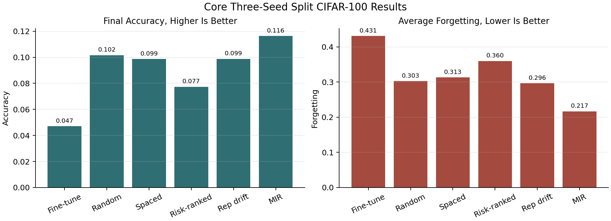
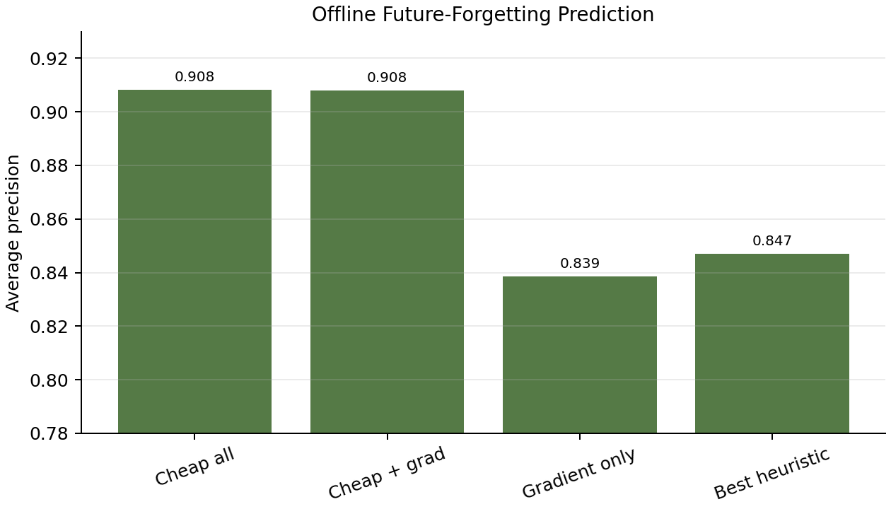
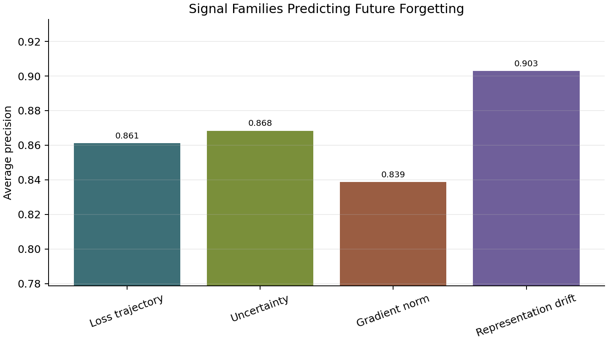
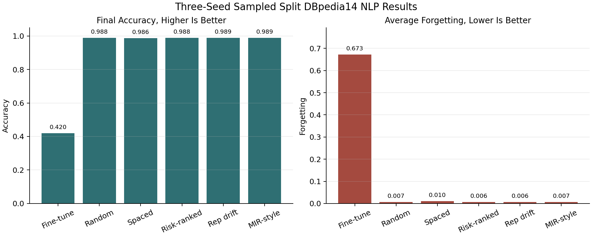

# Research Results

This repository evaluates replay strategies for continual learning. The central
question is whether sample-level signals can identify examples that should be
replayed to reduce catastrophic forgetting.

## Summary

Sample-level signals can predict future forgetting in offline diagnostics.
However, on Split CIFAR-100, the tested spacing-inspired and risk-ranked replay
policies do not improve over random replay as online interventions. MIR-style
replay is the strongest implemented image replay method because it chooses
examples that the current update is likely to damage.

On sampled Split DBpedia14, replay almost eliminates forgetting for DistilBERT.
MIR-style replay has the highest mean final accuracy, while risk-ranked replay
has the lowest mean average forgetting under the same replay sample count.

## Split CIFAR-100

The image benchmark uses 10 sequential tasks with 10 CIFAR-100 classes per
task. The model is a small MLP trained for one epoch per task with a replay
buffer capacity of 2000 examples and replay batches of 32 examples.

| Method | Final accuracy mean | Final accuracy std | Avg forgetting mean | Avg forgetting std | Replay samples |
| --- | ---: | ---: | ---: | ---: | ---: |
| Fine-tuning | `0.04703333333333334` | `0.0017897858344878411` | `0.43103703703703705` | `0.004659165046447831` | `0` |
| Random replay | `0.10156666666666665` | `0.004206344414492624` | `0.30274074074074075` | `0.0014330031201594854` | `45216` |
| Spaced replay proxy | `0.09863333333333334` | `0.003957692930652066` | `0.3131111111111111` | `0.0028043176586942256` | `45216` |
| Risk-ranked replay | `0.0773666666666667` | `0.00189032625050105` | `0.359666666666667` | `0.00245703826527734` | `45216` |
| Representation-drift replay | `0.09876666666666667` | `0.003150132272355142` | `0.29633333333333334` | `0.005716555986402923` | `45216` |
| MIR replay | `0.11636666666666667` | `0.0020033305601755646` | `0.2167037037037037` | `0.003425275213477844` | `45216` |



## Split CIFAR-100 Replay Diagnostics

These seed-0 diagnostics isolate replay selection behavior.

| Method | Final accuracy | Avg forgetting | Replay samples |
| --- | ---: | ---: | ---: |
| Random replay | `0.10129999999999999` | `0.30433333333333334` | `45216` |
| Cheap risk-gated replay | `0.046` | `0.43377777777777776` | `2071` |
| Learned risk-gated replay | `0.0379` | `0.40311111111111114` | `14425` |
| Learned fixed-budget replay | `0.0759` | `0.3587777777777778` | `45216` |
| Learned hybrid, 50/50 class-balanced | `0.0879` | `0.3428888888888889` | `45216` |
| 25% learned-risk plus 75% random | `0.0879` | `0.33144444444444443` | `45216` |
| 25% learned-risk plus 75% class-balanced | `0.0986` | `0.3268888888888889` | `45216` |
| Class-balanced replay | `0.10500000000000001` | `0.2962222222222222` | `45216` |
| MIR replay | `0.1183` | `0.21400000000000002` | `45216` |


The learned future-forgetting score did not align with MIR current-interference
selection:

| Diagnostic | Value |
| --- | ---: |
| Candidate rows scored | `180864` |
| Candidate events | `1413` |
| MIR top-k target/base rate | `0.25` |
| Learned-risk AP for MIR top-k | `0.21600508010478187` |
| Learned-risk ROC-AUC for MIR top-k | `0.42531155059460235` |
| Learned-risk top-k overlap with MIR | `0.1792949398443029` |
| Random expected overlap | `0.25` |


## Offline Forgetting Prediction

The offline predictor results show that future forgetting is predictable from
saved sample-level signals, even when those predictions do not directly produce
a better replay policy.

| Artifact | Best cheap heuristic AP | Learned predictor AP |
| --- | ---: | ---: |
| Random replay, seed 0 | `0.8471253916174554` | `0.9083240127221096` |
| Spaced replay, seed 0 | `0.8267285181601283` | `0.9188844673560967` |

| Feature group | Average precision |
| --- | ---: |
| Cheap all features | `0.9083240127221096` |
| Cheap plus gradient | `0.9080918805327551` |
| Gradient only | `0.8386703932509996` |



Representation drift is the strongest single tested signal family for
Split CIFAR-100 future-forgetting prediction.

| Signal family | Average precision |
| --- | ---: |
| Loss trajectory | `0.8611969396771237` |
| Uncertainty | `0.8683205257744547` |
| Gradient norm | `0.8386703932509996` |
| Representation drift | `0.9028287857978693` |



## Representation Drift

Representation-drift logging preserves the random-replay outcome while adding
diagnostic signal rows.

| Benchmark | Final accuracy mean | Avg forgetting mean | Mean representation drift | Drift AP |
| --- | ---: | ---: | ---: | ---: |
| Split CIFAR-100 random replay | `0.10156666666666667` | `0.30274074074074075` | `0.13586002681815262` | `0.9019374993394821` |
| Split DBpedia14 random replay | `0.9884761904761905` | `0.007222222222222229` | `0.04774213532092315` | unavailable |

Online representation-drift due-time replay gives mixed results:

| Benchmark | Final accuracy mean | Final accuracy std | Avg forgetting mean | Avg forgetting std | Replay samples |
| --- | ---: | ---: | ---: | ---: | ---: |
| Split CIFAR-100 | `0.09876666666666667` | `0.003150132272355142` | `0.29633333333333334` | `0.005716555986402923` | `45216` |
| Split DBpedia14 | `0.9890476190476191` | `0.0026547352123364766` | `0.006222222222222228` | `0.0013471506281091277` | `12096` |

## Sampled Split DBpedia14

The NLP benchmark uses DistilBERT on seven sequential DBpedia14 topic-pair
tasks. Each class has 1000 train examples and 250 evaluation examples. Replay
methods use a memory capacity of 2000 examples and replay batches of 32
examples.

| Method | Seeds | Final accuracy mean | Final accuracy std | Avg forgetting mean | Avg forgetting std | Replay samples mean | Time mean, sec |
| --- | ---: | ---: | ---: | ---: | ---: | ---: | ---: |
| Fine-tune | `0,1,2` | `0.4199047619047619` | `0.11717258623921552` | `0.6727777777777778` | `0.13520861795895403` | `0` | `60.08` |
| Random replay | `0,1,2` | `0.9884761904761905` | `0.003889633877459456` | `0.007222222222222229` | `0.0022194427061597998` | `12096` | `78.37` |
| Spaced replay | `0,1,2` | `0.9864761904761904` | `0.0006598288790737762` | `0.010333333333333342` | `0.0023333333333333353` | `12096` | `81.84` |
| Risk-ranked replay | `0,1,2` | `0.9879047619047618` | `0.0036848651661244023` | `0.0064444444444444506` | `0.0030971910810591924` | `12096` | `79.15` |
| Representation-drift replay | `0,1,2` | `0.9890476190476191` | `0.0026547352123364766` | `0.006222222222222228` | `0.0013471506281091277` | `12096` | `149.52` |
| MIR-style replay | `0,1,2` | `0.9887619047619048` | `0.00256082469709501` | `0.006888888888888895` | `0.0012619796324000614` | `12096` | `132.55` |



## Result Interpretation

Replay is necessary in both benchmarks. Fine-tuning forgets badly, while random
replay recovers much of the lost old-task performance.

Future forgetting can be predicted offline from loss, uncertainty, loss
history, and representation drift. The strongest Split CIFAR-100 predictor
reaches average precision above `0.90`.

Prediction alone is not enough for replay selection. On Split CIFAR-100,
risk-ranked replay underperforms random replay even with the same replay sample
count. MIR performs better because it estimates which old examples are damaged
by the current update.

The strongest compact conclusion is:

```text
Sample-level signals predict future forgetting, but replay policies must choose
examples that protect the model from the current update, not only examples that
look likely to be forgotten later.
```
